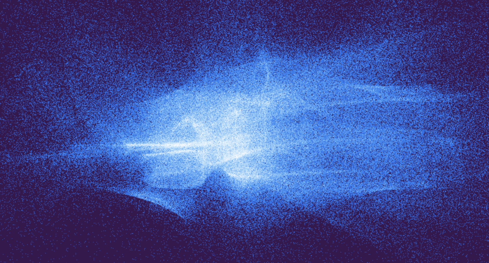
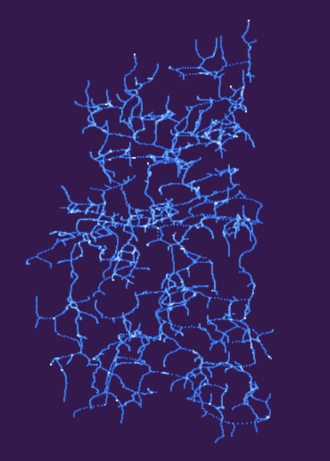
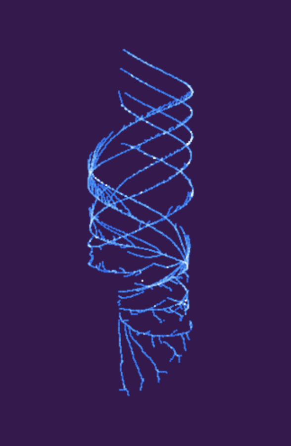
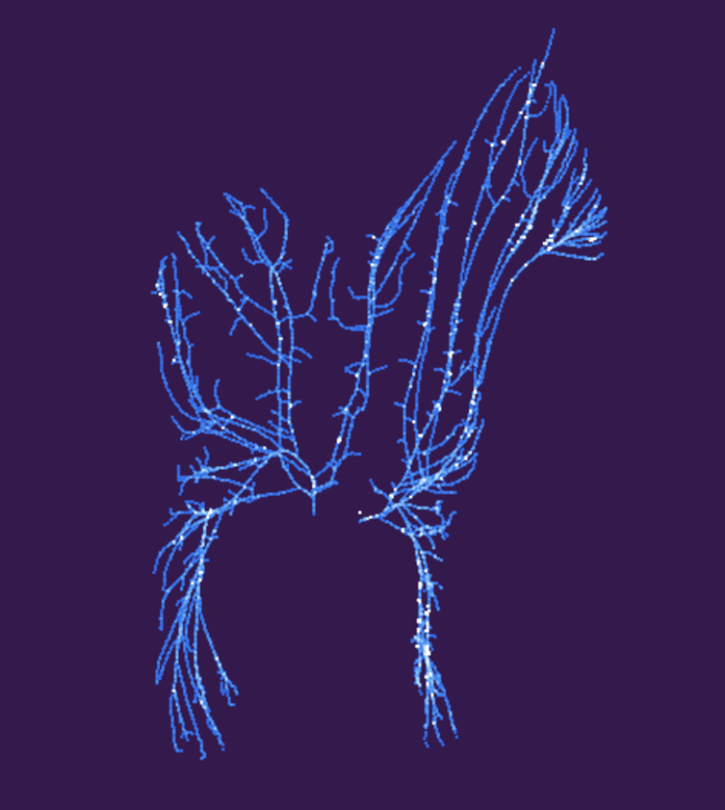
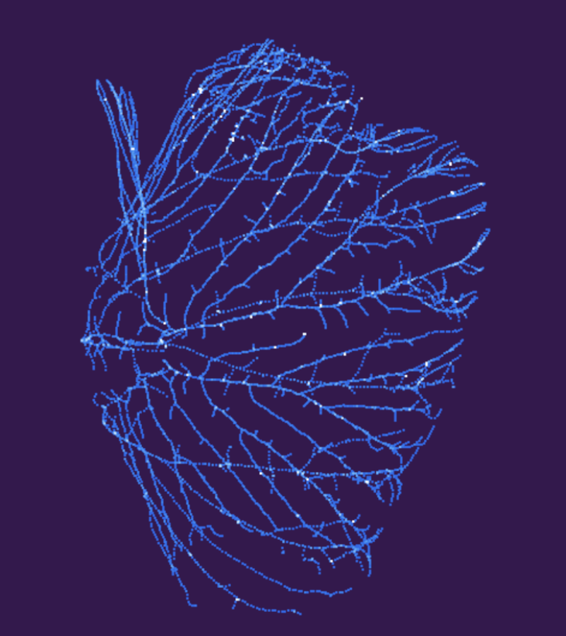
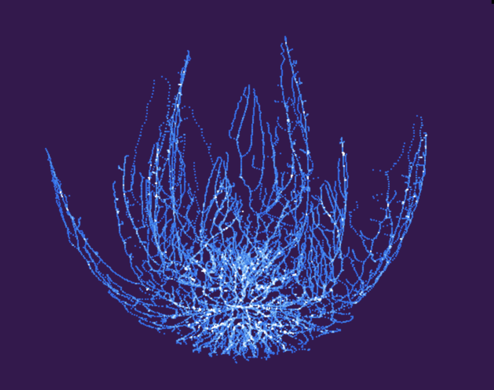

# Procedural Particle Landscape
### Senior Design Project

[Live Demo](http://rickyrajani.com/procedural-particle-landscape)

Particles | Tree
:-------------------------------: | :-------------------------------:
 | 

## Renders with Space Colonization using 3D Models

Spiral | Horse
:-------------------------------: | :-------------------------------:
 | 

Teapot | Rose
:-------------------------------: | :-------------------------------:
 | 

#### Credits
- [WebGL 2.0 Samples](http://webglsamples.org/WebGL2Samples/#transform_feedback_separated_2)
- [WebGL 2.0 Particles](https://github.com/toji/webgl2-particles)
- [Modeling Trees with Space Colonization Algorithm](http://algorithmicbotany.org/papers/colonization.egwnp2007.large.pdf)
